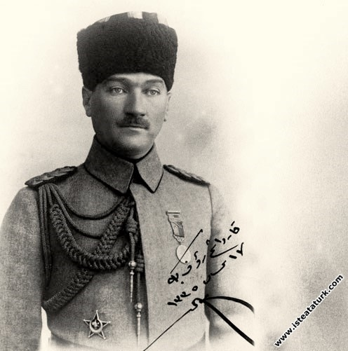
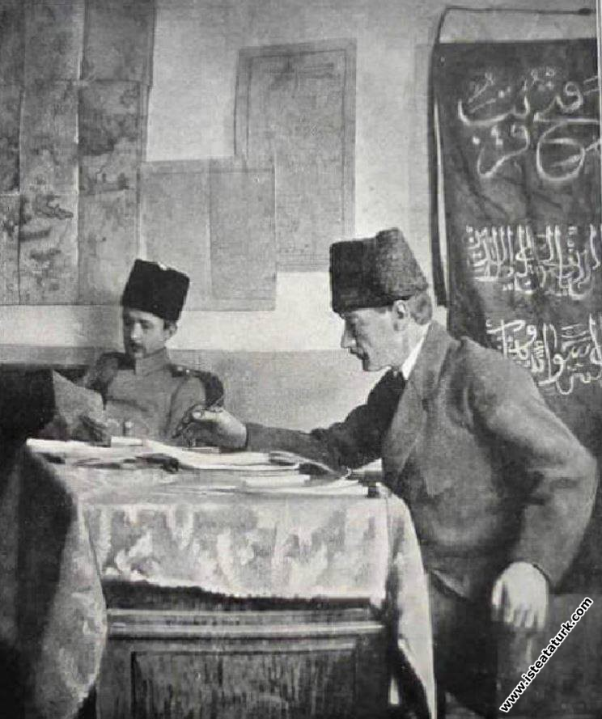

## Zor
Hiçbir zaman zoru yaşamadın, yaşamayacaksın. Nereden mi biliyorum. Çünkü; sen gerektiği kadar okumadın, araştırmadın, çabalamadın. Bunları yaptığını mı düşünüyorsun? 

Aşağıya bak...

1. Bu fotoğraftaki genç, hatıra olarak annesine göndermek için bu fotoğrafı çektirdiğinde 24 yaşındaydı ve tek hedefi, yüzbaşı olarak Rumeli'ye atanmaktı. Ama **başarısız** oldu. Hapse düştü ve Suriye'ye sürüldü.
   
   
   
2. Bu fotoğraftaki genç, bu fotoğrafı çektirdiğinde 27 yaşındaydı ve kurduğu cemiyeti Rumeli'nde teşkilatlandırmak için tam üç yıl mücadele etmişti. Ama **başarısız** oldu.
 

3. Bu fotoğraftaki genç, bu fotoğrafı çektirdiğinde 28 yaşındaydı ve bin bir emekle kurduğu cemiyetini geliştirmek istiyordu. Ama **başarısız** oldu. Cemiyetini kapatıp İttihatçılara katıldı.
   

4. Bu fotoğraftaki genç, bu fotoğrafı çektirdiğinde 28 yaşındaydı ve katıldığı cemiyetteki yanlışları düzeltmek için çabaladı. Ama **başarısız** oldu. Önce suikast düzenlendi. Ardından Libya'ya sürüldü. 
   
   
   
5. Bu fotoğraftaki genç, bu fotoğrafı çektirdiğinde 31 yaşındaydı vatan toprağını korumak için gizli bir kimlikle gerilla savaşına katıldı. Ama **başarısız** oldu. Yaralandı. Neredeyse gözünü kaybediyordu. 
   
   

6. Bu fotoğraftaki genç, bu fotoğrafı çektirdiğinde 33 yaşındaydı. Ülkesini kötü gidişattan korumak için çabaladı. Ama **başarısız** oldu. Uzaklaştırılmak için Sofya'ya gönderildi.
   

7. Bu fotoğraftaki genç, bu fotoğrafı çektirdiğinde 36 yaşındaydı. Savaş esnasında yapılan hataları durdurmak ve memleketin çöküşünü engellemek için raporlar yazdı. Ama **başarısız** oldu. Ordudaki görevinden alındı.
   

8. Bu fotoğraftaki genç, bu fotoğrafı çektirdiğinde 37 yaşındaydı. Veliaht Şehzade'yi ülkenin kötü gidişatına karşı harekete geçirmek için çabaladı. Başlarda onu ikna etmişti. Ama **başarısız** oldu. Uzaklaştırmak için cepheye gönderildi.
   
   

9. Bu fotoğraftaki genç, bu fotoğrafı çektirdiğinde 37 yaşındaydı. Ülkesinin işgale uğrayacağını öngörerek direnişe geçmek için bakanlık talep etti. Ama **başarısız** oldu. Ordusu lağvedildi ve görevinden alındı.
   
10. Bu fotoğraftaki genç, bu fotoğrafı çektirdiğinde 37 yaşındaydı. İşgalcilere teslim olan Tevfik Paşa hükümetinden kurtulmak için Ahmet İzzet Paşa'ya destek verdi. Onun için propaganda yaptı. Ama **başarısız** oldu. Başkent işgal edildi.
   
   
   
11. Bu fotoğraftaki genç, bu fotoğrafı çektirdiğinde 37 yaşındaydı. Halkı işgale karşı uyandırmak için gazete çıkardı. Ama **başarısız** oldu. Gazetesi maddi imkansızlık nedeniyle kapandı.

12. Bu fotoğraftaki genç, bu fotoğrafı çektirdiğinde 38 yaşındaydı. İşgale karşı halkı örgütlemek için Anadolu'ya geçti. Rütbesi söküldü. Mesleğinden atıldı. Asi ilan edildi.

13. Bu fotoğraftaki genç, bu fotoğrafı çektirdiğinde 38 yaşındaydı. Açılan Meclis-i Mebusan'a başkan seçilmek ve mücadeleyi meclisten yönetmek istedi. Ama **başarısız** oldu. Arkadaşları onu seçmedi.

14. Bu fotoğraftaki genç, bu fotoğrafı çektirdiğinde 38 yaşındaydı. Memleketini kurtarmak için çabalamasına rağmen devleti tarafından asi ilan edildi. Hain ilan edildi. Kafir ilan edildi. Ve idamına hükmedildi.

15. Ve o genç, 23 Nisan 1920 günü, TBMM'yi açtı. Meclis başkanı seçildi. Sonrasını hepimiz biliyoruz. 40 yaşında başkomutan, 41 yaşında kurtarıcı ve 42 yaşında kurucu cumhurbaşkanı... **başarısızlık** onu asla durduramadı.
   

--- 

Okuduklarının hepsi çok zor. Kaç defa pes etmek zorunda kaldın? Belki buraya kadar okumadan direkt geldin. Oku! Oku! Oku! 

Kardeşim; okumamız, öğrenmemiz ve gelişmemiz lazım. Cesur olun. Korkmayın! Deli bir yüreğiniz olsun. Delin sarp dağları, yırtın boyunuzdan büyük dalgaları, aşın kızgın çölleri. Emek verin ve başarın, tadını çıkarın. Daha iyisini başarın, daha çok çalışın. 

Eğitim sistemini bahane etmeyin. Ata'm bilmiyor muydu bahane etmeyi? "Bu ülkeden adam olmaz!" demeyi bilmiyor muydu? Demedi, çalıştı ve çabaladı. Fabrikalar kurdu, tarımı güçlendirdi. Şimdilerde her şeyimizi kaybettik. 

Ata'm bunların hepsini yaşamış ve tecrübe etmiş. Bize nasihatler bırakmış. 

>[!tip]
>  "Cebren ve hile ile aziz vatanın bütün kaleleri zapt edilmiş, bütün tersanelerine girilmiş, bütün orduları dağıtılmış ve memleketin her köşesi bilfiil işgal edilmiş olabilir."

Bütün kalelerimiz yıkıldı. İnsanlarımız suçsuz yere toplu gömüldüler. Başaramadık demediler. Hakaret ettiler ve en sonunda **galibiyet kazanılmış** imajı vermek için tüm medya kanallarında bu işin altından başarıyla kalktık dediler. Dinle yönetilen bir imparatorlukta bile Ata'm bunu görmüş.

>[!tip]
> "İstiklal ve cumhuriyetine kastedecek düşmanlar, bütün dünyada emsali görülmemiş bir galibiyetin mümessili olabilirler."

## Dostlarım ve genç arkadaşlarım
Tüm bu siyaset safsatası ve gençlerin körelmesi durumumuzu hiç iyiye götürmüyor. **Kalkın ve toparlanın**. Biz bu ülkenin kadim kurtarıcılarıyız. **Genciz** ve **deliyiz**. 

Dinleyin ve Güçlenin:

[İzlemek için tıklayın](https://youtu.be/wQPtkbAiRrU)

[[genclige-hitabe|Ata'mın ruhu şad olsun]].
